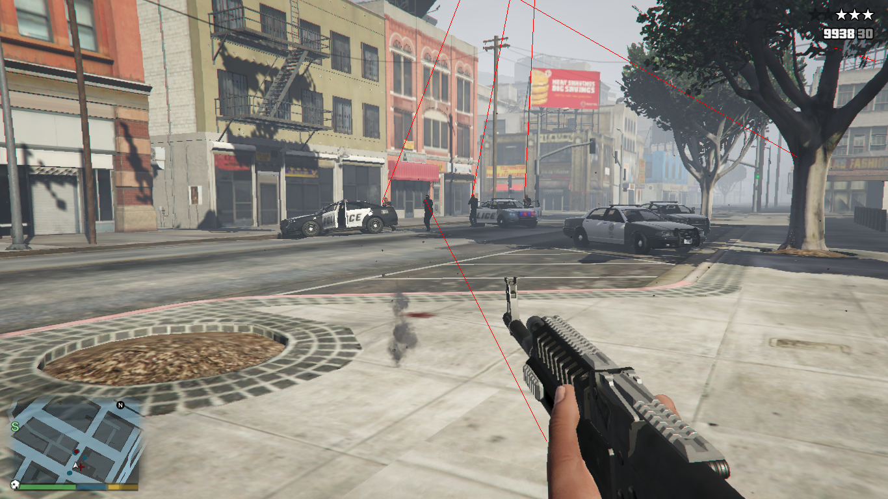

# BulletLines <small>for GTA V</small>

[![5mods][5mods-img]][5mods-url] [![Documentation][docs-img]][docs-url] [![AppVeyor][appveyor-img]][appveyor-url] [![CodeFactor][codefactor-img]][codefactor-url] [![Discord][discord-img]][discord-url]

BulletLines is a mod for Grand Theft Auto V that allows you to use the [Trajectory Prediction Lines](https://swordartonline.fandom.com/wiki/Bullet_Line) (also called Bullet Lines) from Gun Gale Online. Is implemented in a way that every single ped in the game world can use it, so you can know at all times who is aiming at you.

    

[5mods-img]: https://img.shields.io/badge/5mods-download-20BA4E.svg
[5mods-url]: https://www.gta5-mods.com/scripts/bulletlines
[docs-img]: https://github.com/justalemon/BulletLines/workflows/Documentation/badge.svg
[docs-url]: https://github.com/justalemon/BulletLines/actions?query=workflow%3ADocumentation
[appveyor-img]: https://img.shields.io/appveyor/ci/justalemon/bulletlines.svg?label=appveyor
[appveyor-url]: https://ci.appveyor.com/project/justalemon/bulletlines
[codefactor-img]: https://www.codefactor.io/repository/github/justalemon/bulletlines/badge
[codefactor-url]: https://www.codefactor.io/repository/github/justalemon/bulletlines
[discord-img]: https://img.shields.io/badge/discord-join-7289DA.svg
[discord-url]: https://discord.gg/Cf6sspj
